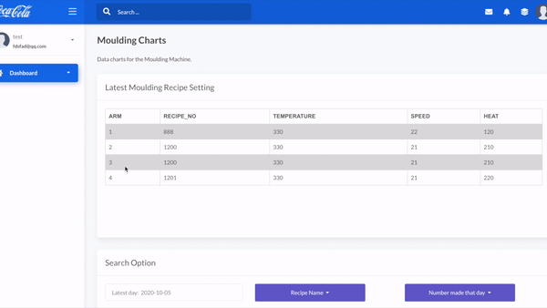

# Flask-Data-Visualization

This project is a promising showcase about data visualization for industrial manufacture factories, being affordable, intuitive and easy to conduct. **Live demo**: https://data-visualization-flask.herokuapp.com 
  
Zoom & drag and displaying other field data when hovering: (**21.08.2020 update**) 
  
Display current setting and plot updated data for a moulding machine: (**09.10.2020 update**) 

### Description of two main components are the following:  
[data_persistence.py](https://github.com/MaYatKit/Flask-Data-Visualization/blob/master/data_persistence.py): Automatically periodically data persisting from constantly increased CSVs onto Google G Suite location. Normally, PLCs of industrial machinery are capable to spew out data constantly, no matter what format it is, this script is adaptive to fit in with slightly changes; Also, we choose SQLite to storage data, which is a standalone file with [free tool](https://sqlitebrowser.org/) to open and view data directly, and SQLite is simple to populate with; Finally, Google G Suite are choosed by many traditional manufacture factories to share and manage files, which is suitable to storage the DB file with an automatic synchronization 

[Web application](https://data-visualization-flask.herokuapp.com/rock_roll_charts.html): We utilize Flask and Chart.js to conduct this web application, retrieving data from a SQLite DB file which is storaged on Google G Suite location. You can look into charts of manufacture data by date, recipe and which time in a day; also, you can dig in points of data by hovering on the curve; and normally, one machinery might have different recipes to manufacture in one day, so that we add recipe marker on the start point of each cycle.

### Update
**21.08.2020:** Added a zooming function for graphs and code for displaying other fields when hovering on a field such as display mould temperature when hovering on oven temperature with the nearest timestamp. 
**09.10.2020** Added another page for the second which is a moulding machine with 4 arms, each arm can install different moulds with different recipes. Also, the machine can rotate horizontally and extand the arm into an oven that heats the arm. We collect data from the oven and four arms utilizing a Python script and plot them on a new page; and, we display current machine setting on the top of the page, which mean design engineer do not need to go down to the factory but still can know what latest setting is.

### Future work
A zooming function for graphs is scheduled and we plan to display other fields when hovering on a field such as display mould temperature when hovering on oven temperature with the nearest timestamp; also, a CSV export function which can be choosed field and range is being considered. 
**21.08.2020:** We plan to optimize the speed of zooming. 
**09.10.2020** We plan to add functions to record abnormal manufacture cycles and use machine learning to predict result of a machine setting.  
